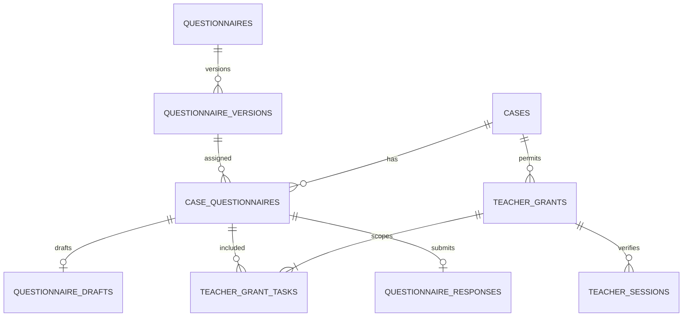

# 共用個案、問卷、任務與教師授權規格 v1.1

狀態：依使用者補充更新的對接基準；九張核心模型與 InitialSharedCore migration 已套用至使用者本機 earlycare_dev，虛構 seed 重跑及跨連線查回通過；現有教師測試 API 尚未改接 MySQL。更新日期：2026-10-05。檔名沿用 shared-contract-v1.md。實作進度見 database/migration-setup.md。

### 已確認與待確認

- 確定使用 MySQL，尚無共用資料庫；由使用者本人統整 schema 與 EF Core migration。其他組員開發現況未知，不假定尚未建表。
- 幼兒個案暫由 A 的醫療人員端建立，仍待 A 確認；問卷指派及複評由有該個案權限的醫護人員決定。
- 教師授權由已綁定個案的家長操作，不限時，全部指定任務提交後失效；目前個管師不能代辦。
- 提供草稿；家長及教師提交後不能修改。醫護人員先只修改匯出的 Excel，系統保留原始答案，不提供 Excel 匯回或原始答案修訂功能。
- 已確認家長以手機 OTP 登入，首次個案綁定另使用醫護建立、指定個案及家長手機的一次性邀請碼；後續登入不用重複綁定。使用者與早療組長確認：家長只看教師問卷是否完成，不看教師答案、分數或補充觀察；醫護查看範圍依院所及權限契約核對，不能跨院所直接放行。


此文件依既有分工、9/30 需求會議與已驗證的教師測試流程制定。與舊規劃衝突時：教師授權不限時；只有指定任務全部提交成功或授權撤銷才失效。會議提到的就診前通知天數不等於授權期限。

## 1. 三人共同遵守的識別規則

| API 欄位 | MySQL 欄位 | 意義 | 產生者 |
| --- | --- | --- | --- |
| caseId | case_id | 幼兒的系統個案主鍵 | 個案模組後端 |
| caseCode | case_code | 給使用者看的個案代碼，例如 CASE-DEMO-001 | 個案模組後端 |
| questionnaireId | questionnaire_id | 問卷種類主鍵，例如 SNAP-IV | 表單模組後端 |
| questionnaireVersionId | questionnaire_version_id | 一份不可變題目／選項／計分定義的主鍵 | 表單模組後端 |
| taskId | task_id | 指定個案、填答角色、問卷版本與輪次的一份填答任務 | 表單指派模組後端 |
| grantId | grant_id | 教師可填一組指定任務的授權主鍵，不是登入憑證 | 教師授權模組後端 |
| responseId | response_id | 已正式提交答案的主鍵 | 表單提交模組後端 |

所有上述 Id 均採伺服器產生的 UUID（C# Guid.NewGuid），JSON 使用小寫含連字號的 36 字元字串，MySQL 使用 CHAR(36)、ascii_bin。欄位與路徑明確命名，不以 caseCode、姓名、身分證、病歷號或授權碼取代主鍵。不讓前端自己決定正式 Id。caseCode 僅顯示／搜尋，不當外鍵；範例代碼的樣式不是正式連號規則。

MySQL 表／欄位為 snake_case；API JSON 為 camelCase；C# DTO 為 PascalCase。狀態值皆為大寫英文。時間由後端產生，資料庫 DATETIME(6) 一律存 UTC，API 回傳 ISO 8601 UTC 字串（Z）；畫面才轉臺灣時間。MySQL connection 的時區也設 UTC。NULL 代表尚未發生，不用空字串或虛構日期。

## 2. 共同資料關係



一個 case 可有多份 task；一個 task 固定一份版本、一個填答角色、一個指派輪次。教師授權可涵蓋同一 case 的多份 TEACHER 任務，不能跨 case 或包含 PARENT 任務。現有示範 taskId 字串為固定 fixture，正式版本必須改成每筆不同的 UUID。

## 3. 個案最小契約（個案模組）

cases 最少包含 case_id、case_code、child_name、birth_date、sex、case_status、created_at_utc、updated_at_utc。sex = MALE / FEMALE / UNKNOWN；不要用未知值推定性別。年齡由出生日期與後端明確的參考日計算，不永久存可變的 age。正式個案建立必填姓名與出生日期；正式教師 API 僅回傳經確認必要的遮罩姓名、caseCode、年齡及允許的性別，不直接回傳出生日期、病歷或家庭資料。

case_status = NEW / TO_CONTACT / APPOINTED / WAITING_FORM / FORM_COMPLETED / COMPLETED，初始 NEW。COMPLETED 是整體個案流程結束；FORM_COMPLETED 僅指當輪必要表單已完成。表單完成不能自動將個案結案。聯絡資訊、家長關係、狀態歷程由相應模組擴充；教師不得任意查詢通用 cases API。

POST /api/cases → 201 與 caseId；GET /api/cases/{caseId} → 已登入且有該個案權限者才能讀取。建立與更新都由後端檢查權限。

家長綁定流程（2026-10-05 使用者確認）：醫護建立 case、確認家長關係並登記手機 → 系統產生指定 case 與家長手機的一次性綁定邀請碼 → 家長以手機 OTP 登入 → 輸入邀請碼 → 後端確認邀請有效、手機符合、尚未使用且未撤銷 → 在同一交易建立 case_parent_links 並消耗邀請碼 → 顯示「我的孩子」。關係以固定 parentUserId + caseId 保存，手機為帳號驗證資料，不作個案關係主鍵；OTP 證明手機可用，不單獨證明監護關係。

後續只需 OTP 登入，從既有綁定關係取得孩子，不重複輸入邀請碼；新增另一位孩子須使用新邀請碼。綁定邀請與教師授權為不同憑證，邀請需有期限、一次性且可撤銷；具體期限、發送方式、多位監護人、手機變更及解除綁定流程另訂，不能套用教師授權不限時規則。不可單憑姓名、生日或 caseCode 自助綁定。正式綁定完成前僅使用明確標示的虛構測試關係，不開放正式家長授權。此關係表及邀請表尚未納入 SQL 草案，等待身分模組 ID 契約。

家長查看教師結果（使用者與早療組長確認）：只顯示教師是否已完成該份問卷，不顯示逐題答案、分數、判讀摘要、補充觀察或草稿內容。家長的狀態查詢必須先驗證 parentUserId 與 caseId 的有效綁定；回應只包含識別該任務所需的 taskId、questionnaireTitle、assignmentRound 及 isCompleted。isCompleted 僅在 task_status=SUBMITTED 時為 true，保存草稿或只提交同一 grant 的另一份問卷不算此份完成。取消任務不列入待填清單，不將 CANCELLED 顯示成完成；授權撤銷也不等於問卷完成。

後端使用專用完成狀態 DTO，不回傳教師 response、草稿或計分資料再由前端隱藏。家長不能透過一般任務、答案、草稿或匯出接口繞過限制；院所醫護的答案查看仍依其權限驗證。此處只確定教師問卷的家長可見範圍，不擴大或縮減其他角色已定的權限。


## 4. 問卷與版本（表單模組）

questionnaires 使用穩定 questionnaire_code（SNAP_IV、CLANCY），每個種類可有多份版本。questionnaire_versions 的 version_number 是專案版本號，例如 1.0.0，**不是院方核定或臨床認證版本宣告**。種類、填答角色與版本號組合唯一。questionnaire_versions 增加 respondent_role（PARENT / TEACHER），每份版本只對應一種角色。即使題目相同，家長版與教師版使用不同版本 ID，以便分別管理說明與後續改版。家長版來源尚待表單組員確認，不直接將教師 PDF 當作家長版。

版本狀態 = DRAFT / PUBLISHED / RETIRED。只有 PUBLISHED 可建立新任務。發布前可修改；發布後題目、順序、選項、觀察期間、必填性與計分定義不可原地修改，變更必須建立新版本。RETIRED 禁止新指派，既有任務仍依原版本接續；若必須中止既有任務，另行撤銷授權及取消任務。現有任務不自動升級問卷版本。

定義 snapshot 存 JSON，最少包含 title、instructions、sourceReference、questions。每題有 questionId（如 SNAP_IV_Q01）、order、text、type=singleChoice、required=true、options；選項有 value、label、score。答案以 questionId + optionValue 保存，不依畫面索引或選項文字比對。SNAP-IV 共 26 題，值 0/1/2/3；克氏共 14 題，值 0/1/2。跨版本 questionId 只有在意義相同時才沿用。補充觀察為平台獨立選填欄，不混入量表題目或分數。

初版計分 definition 可保留 null，未經確認不得產生診斷或自行推定量表判讀。所有使用者以同一 version snapshot 顯示及驗證答案。

## 5. 填答任務（表單指派模組）

實體表名 case_questionnaires，API 主鍵統一叫 taskId（對應原分工 CaseQuestionnaire）。task 固定 caseId、questionnaireId、questionnaireVersionId、respondentRole（PARENT / TEACHER）、assignmentRound（正整數）、isRequired（boolean）。

同一 case、種類、角色、輪次只能有一份任務。第一輪為 1；複評或另一次填寫建立新輪次與新 taskId，保留先前結果，不重開已提交任務。若同輪需多位教師，必須先擴充 respondentSlot 契約與唯一鍵，v1 不默默覆蓋。

task_status = PENDING / IN_PROGRESS / SUBMITTED / CANCELLED。指派後 PENDING；首次成功保存草稿後 IN_PROGRESS；成功提交 SUBMITTED；由有權限的醫護指派者取消則 CANCELLED。撤銷授權本身不取消任務、不刪草稿。需要再次授權時可授予同一未提交 task，沿用既有草稿。前端顯示最後成功保存時間，尚未保存的變更離開時提醒；不得將本機暫存顯示成後端保存成功。

POST /api/cases/{caseId}/tasks：具該個案指派權限的醫護人員傳 questionnaireVersionId、respondentRole、assignmentRound、isRequired。後端確認種類、版本角色與任務角色一致、已發布版本與 case 範圍；重複指派回 409，不新增重複 task。複評由醫護評估，不自動定期重開。

GET /api/cases/{caseId}/tasks：醫療／個管端經角色及個案權限檢查。教師使用 scoped API，不接受前端任意 caseId。

## 6. 教師授權（授權模組）

grant_status = ACTIVE / USED / REVOKED；不設 EXPIRED 或 expiresAt。ACTIVE 是可驗證的授權；USED 是其全部指定任務成功提交；REVOKED 是已撤銷。兩個終止狀態不互相覆蓋、不恢復 ACTIVE。授權成功驗證、閱讀問卷及保存草稿不消耗授權。

一筆授權至少包含一份尚未提交、未取消的 TEACHER 任務。所有 task 必須屬於同一 case。v1 所有被授予的任務都必須提交，才使 grant USED；isRequired 僅用於個案當輪完成度，不能將 grant 中的任務跳過。授權建立後 task 集合不可直接加減；重新配置必須撤銷舊 grant 並建立新 grant，取消任務前也須撤銷包含它的 ACTIVE grant。同一 task 同時最多一筆 ACTIVE grant（服務交易內鎖定 task 並檢查）；重新授權先終止舊筆。

正式建立授權必須由已驗證且已綁定該個案的家長操作；目前不允許個管師或其他醫護代辦。後端確認同意紀錄。issuedByUserId、consentReferenceId 從可信身分／同意模組取值，不接受任意前端姓名或 userId 當作同意。共享 schema 先保留這兩個外部 ID，待組員確認 users／consent 表後補外鍵。正式 grant 不得為 NULL；只有 isDevelopment=true 的虛構資料可暫缺。

短碼由後端安全亂數產生，不固定成 1234，不由前端自造。開發版既有格式為 16 個十六進位字元，顯示四組四碼；首尾空白、連字號及大小寫正規化後計算 SHA-256，資料庫只存 code_hash（二進位 32 bytes，唯一）。短碼只在建立時回傳一次，不提供再次查閱明碼接口。正式上線前另行確認碼強度、驗證限制與發送方式。

驗證成功建立高熵會話 Cookie，HttpOnly、SameSite=Strict，正式 HTTPS 必須 Secure；會話只代表該 grant，不代表驗證教師本人。每次讀取任務、保存草稿及提交都重新檢查 grant 與 task 狀態。登出使會話失效但不消耗 grant。會話憑證不放網址、日誌、localStorage 或 sessionStorage。教師授權無期限不等於會話無需生命週期管理；會話到期須重驗證仍有效的授權碼，不能把 grant 當成 EXPIRED。

撤銷立即阻擋該 grant 的所有會話及讀寫，不刪已保存答案。家長撤回同意時須由同意模組通知撤銷相關 ACTIVE grants。revoke 已 REVOKED → 200 原狀態；已 USED → 409，不將 USED 改為 REVOKED。

## 7. 提交、修訂與一致性（表單模組與授權模組共同）

每個 task 最多一份目前草稿與一份正式 response。草稿允許缺題，已填答案必須合法，姓名／日期可暫空；提交必須完整，後端驗證題號、值、版本、填表人及有效日期。缺題回 400，不建立 response、不改變任務原有狀態，grant 保持 ACTIVE。不得相信前端計分、完成度或 grant 狀態。

草稿使用 revision（從 1 起，每次保存 +1）做樂觀鎖。首次保存 expectedRevision=0，後續攜帶前次 revision；不一致回 409 DRAFT_CONFLICT，保留前端內容供使用者處理。教師草稿寫入在交易內依 grant → task 順序鎖定並重查狀態，避免撤銷或提交後仍覆寫；家長草稿由其身分及個案關係驗證並鎖定 task。已提交任務不再接受草稿寫入。草稿不計入正式完成統計。

家長及教師提交後不得更新、刪除或重開原始 response。2026-10-05 已確認：醫護人員先只修改匯出的 Excel，用於離線整理；修改不會同步 MySQL。系統保留原始答案，儀表板仍使用系統原始結果。第一版不提供 Excel 匯入或醫護直接修改原始 response。未來若需要匯回，另行設計權限、欄位驗證與修訂紀錄，不覆蓋原始答案，也不重新啟用 task 或 USED grant。

匯出檔建議攜帶 caseCode、responseId、taskId、questionnaireVersionId、questionId 及匯出時間，方便識別來源；不得包含授權碼或會話憑證。誰能匯出、哪些個案及欄位可匯出仍待權限確認，不因醫護角色就自動開放全部資料。

提交採一個資料庫交易：鎖 grant → 依 UUID 排序鎖其 tasks → 檢查 ACTIVE/角色/版本/任務 → 驗證答案 → 寫 response（task_id 唯一）→ task SUBMITTED → 若所有指定 tasks 均 SUBMITTED 則 grant USED、全部會話失效 → commit。撤銷也鎖同一 grant；撤銷先完成則提交拒絕，提交先完成且整組已結束則撤銷回 409。例外 rollback，不顯示成功也不消耗授權。

Idempotency-Key 為提交請求 UUID，按 grant + key 唯一。相同 key、同 task 與相同正規化 payload 回原 response；相同 key 不同內容回 409。授權 USED 後僅允許該已驗證會話的同一已提交請求查回同一完成收據，不能新建答案或讀回全文；實作時需保留短期去重收據通道，而不是開放一般 task API。只有成功提交的正式 response 計入完成統計。

## 8. API v1 對接契約（規劃，尚未實作）

| 方法與路徑 | 主責 | 重點 |
| --- | --- | --- |
| POST /api/cases | 個案 | 建立 case，回 caseId／caseCode |
| GET /api/cases/{caseId} | 個案＋權限 | 只給有該個案權限的人 |
| POST /api/cases/{caseId}/tasks | 表單指派 | 鎖定已發布版本與角色／輪次 |
| GET /api/cases/{caseId}/tasks | 表單＋權限 | 給醫療端追蹤，不給教師任意查詢 |
| POST /api/cases/{caseId}/teacher-grants | 授權＋身分／同意 | taskIds；後端核對身分、個案及同意 |
| POST /api/teacher-access/verify | 授權 | code；回工作台路徑與會話，不回 cookie 明碼 |
| GET /api/teacher-access/workspace | 授權＋表單 | 依會話回 case 摘要與該 grant 指定 tasks |
| GET /api/teacher-access/tasks/{taskId}/draft | 表單＋授權 | 讀取該 grant 範圍的未提交任務草稿 |
| PUT /api/teacher-access/tasks/{taskId}/draft | 表單＋授權 | questionnaireVersionId、expectedRevision、respondentName、filledOn、answers、observation |
| POST /api/teacher-access/tasks/{taskId}/submit | 表單＋授權 | 同版完整答案，Idempotency-Key 必填 |
| POST /api/teacher-grants/{grantId}/revoke | 授權＋權限 | 僅原授權家長且仍有該個案關係；不開放個管師代辦 |
| POST /api/teacher-access/logout | 授權 | 使會話失效，不改 grant |

所有有憑證或個案內容的接口禁止快取。前端只拿到被授權內容，後端忽略／拒絕額外指定的 caseId。PUT／POST 使用 same-origin 與 CSRF 防護；Cookie 不取代寫入來源與 CSRF 驗證。授權碼驗證失敗統一 401，不透露該碼是否存在或屬於誰。

錯誤 JSON 統一 `{ "code": "GRANT_UNAVAILABLE", "message": "授權無法使用", "traceId": "伺服器關聯碼" }`；400 INVALID_INPUT、401 SESSION_REQUIRED／GRANT_UNAVAILABLE、404 TASK_NOT_FOUND（含非授權 task）、409 VERSION_MISMATCH／DRAFT_CONFLICT／TASK_SUBMITTED／IDEMPOTENCY_CONFLICT、429 TOO_MANY_ATTEMPTS、503 SAVE_UNAVAILABLE。後端成功 commit 才回 200／201。不得將答案、授權碼或個案內容放進 traceId／audit／日誌。

提交格式範例（虛構；只展示一題，正式提交須有全部必填題；UUID 需來自共用 seed）：

```json
{
  "questionnaireVersionId": "30000000-0000-4000-8000-000000000001",
  "respondentName": "示範老師",
  "filledOn": "2026-10-05",
  "answers": [{"questionId":"SNAP_IV_Q01","optionValue":"1"}],
  "observation": "虛構觀察內容"
}
```

## 9. 分工與依賴

2026-10-05 使用者補充優先於舊資料夾分工：由使用者統整 MySQL schema 與全部 EF Core migration；幼兒個案暫由 A 的醫療人員端建立，須再核對 A 的現況及正式責任。其他模組沿用小組分工，但尚未確認完成度，不按舊代號宣告已完成。

1. 各組員提供現有 entities、資料表、API 或分支位置；由使用者統整名稱及 migration，其他人不另行建立同一批表。
2. 醫療端負責個案建立與問卷指派，家長版／教師版及複評輪次由醫護決定。
3. 表單模組提供角色專用版本、task、draft、response；教師授權模組共用 taskId／questionnaireVersionId，不能另建一套答案表。
4. 家長綁定、同意、結果查看與 Excel 匯出權限需與身分／權限模組對接；未確認前不可開放正式權限。
5. 先整合虛構 case、一份教師 SNAP-IV、一筆測試授權與草稿／正式提交儲存，再加入克氏、家長任務與 Excel 匯出。

## 10. 現有程式與正式規格的差異

目前 /api/dev/teacher-workspace/* 是記憶體開發接口、固定字串 taskId／caseId、單一 SNAP JSON 與臨時會話，沒有正式 draft 或 response 儲存；本規格的草稿仍待實作。既有兩題 /teacher/test-form 是另一個測試模組。兩者暫時保留，遷移時建立真正 UUID 與資料表，不能將每次重啟後的固定 fixture 當作正式主鍵。

現有 JSON 的 questions 陣列與 0 起算索引只是畫面試做；正式版本改成 questionId + optionValue，選項值為字串，分數為數字。現有「驗證新碼會登出同一碼舊會話」可保留為 v1 單一有效會話政策；正式會話過期與 CSRF 防護尚待實作。

附錄建表草案：database/shared-schema-v1.sql。草案未接 users／consents 外鍵，未包括家長綁定、聯絡人、狀態歷程、Excel 修訂、去重收據、FHIR、自動計分與全部稽核欄位；不能直接宣告整體系統已完成，也不要在未備份的現有資料庫執行。後續透過 EF Core migration 實作，而不是與 raw SQL 並行管理正式 schema。

草案共九張表；複合外鍵核對授權與任務的個案／角色及答案版本，唯一鍵限制同輪指派和每份 task 的正式答案。TEACHER 角色限定、正式同意必填、同時只有一筆 ACTIVE 授權、狀態轉移與版本不可變性仍須後端交易保證，不能只靠外鍵。家長答案沿用相同 task／draft／response 表，但 grant 欄位為 NULL，家長權限及其提交去重範圍須與身分模組另行對接。會話有效期間與完成收據保留期間在實作前統一訂定，不影響授權不限時的規則。

## 11. 共同驗收

- 已綁定家長只能取得教師問卷完成狀態；API 回應無教師答案、分數、判讀摘要、觀察文字或草稿，直接請求答案及匯出也不得繞過限制。
- 每份問卷獨立判定完成；草稿、撤銷與取消都不視為正式提交，未綁定個案不能查詢狀態。
- 不同 case、同 case 的家長任務或未被授予的 task 都無法被教師讀寫。
- 發布後改題必須產生新 version；舊 task 題目與答案不變。
- 草稿缺題可保存且重啟後仍存在；衝突不覆蓋新內容。正式提交缺題拒絕且 grant 仍 ACTIVE。
- 任務與版本角色一致，教師任務不能使用家長版版本。
- 家長及教師提交後不能修改；醫護修改匯出的 Excel 不改變系統原始答案與授權狀態。
- 尚未綁定的家長及個管師無法代為建立正式教師授權。
- 同一 grant 的 SNAP 提交後，克氏仍可填；全數提交後 grant USED。
- 重送／並行提交只保存一份 response；撤銷與提交並行有單一一致結果。
- MySQL 保存後，重啟服務仍保留個案、版本、任務、授權狀態、草稿與正式答案；登入會話可以要求重新驗證，不得因此刪除資料。
- 所有教師畫面以 1440 × 900 驗收；首頁與完成頁完整顯示，長表單在主內容區捲動。
